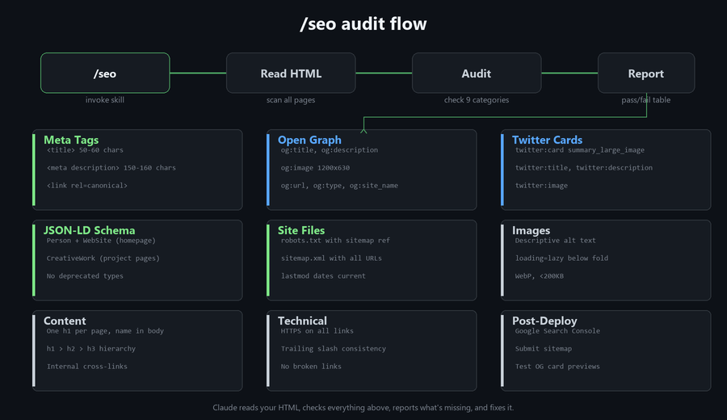

# /seo — Claude Code SEO Skill

A lightweight SEO skill for Claude Code. Built for static portfolio and personal sites (GitHub Pages, Netlify, Vercel). No build tools, no agents, no API calls. Claude reads your HTML, checks what's missing, and adds it.



## What it does

You say `/seo` (or just mention SEO, meta tags, search visibility, etc.) and Claude runs a 9-point audit against your HTML files:

| Category | What it checks |
|----------|---------------|
| Meta tags | `<title>`, `<meta description>`, `<link rel=canonical>` |
| Open Graph | og:title, og:description, og:image, og:url, og:type |
| Twitter Cards | twitter:card, twitter:title, twitter:description, twitter:image |
| JSON-LD schema | Person + WebSite on homepage, CreativeWork on project pages |
| Site files | robots.txt, sitemap.xml with correct URLs and dates |
| Images | Descriptive alt text, lazy loading, file size |
| Content | H1 per page, heading hierarchy, internal cross-links, name in body text |
| Technical | HTTPS links, trailing slash consistency, broken link check |
| Post-deploy | Google Search Console setup, sitemap submission, OG card testing |

It reports a pass/fail table, then offers to fix everything it found.

## Install

Copy `SKILL.md` into your Claude Code skills directory:

```bash
# Create the skill directory
mkdir -p ~/.claude/skills/seo

# Copy the skill file
cp SKILL.md ~/.claude/skills/seo/SKILL.md
```

That's it. The skill is available in your next Claude Code session.

### Where the file goes

```
~/.claude/
  skills/
    seo/
      SKILL.md    <-- this file
```

Claude Code loads skills from `~/.claude/skills/` automatically. Each skill lives in its own folder with a `SKILL.md` that has YAML frontmatter (name + description) controlling when it triggers.

## Usage

### First time

Tell Claude about your site so it fills in the right values:

```
/seo
My site is at https://janedoe.com, hosted on GitHub Pages.
Pages: index, about, resume, projects/robotics-arm
LinkedIn: linkedin.com/in/janedoe
GitHub: github.com/janedoe
I want to rank for "jane doe software engineer" and "jane doe portfolio"
```

Claude reads your HTML files, runs the audit, shows you what's missing, and offers to add everything.

### After that

```
/seo                          # re-run the audit
/seo run audit                # same thing
/seo add meta tags            # just the meta tags
/seo check my images          # just image alt text + optimization
```

Or just mention SEO naturally. "Why doesn't my site show up when I search my name?" triggers the skill automatically.

### What gets added

For a typical 5-page static site, Claude adds:

- Per-page `<meta description>` tags (unique, 150-160 chars, keyword-rich)
- Per-page canonical URLs
- Open Graph tags (title, description, image, url, type, site_name)
- Twitter Card tags (summary_large_image)
- JSON-LD structured data (Person + WebSite on homepage, CreativeWork on project pages)
- `robots.txt` pointing to the sitemap
- `sitemap.xml` with all pages and last-modified dates

It uses existing images from your site for OG cards rather than requiring you to create new ones.

## Scope

This skill is designed for small static sites: portfolios, personal pages, project showcases. The kind of site where you wrote the HTML yourself (or with Claude) and deploy by pushing to a branch.

It does not cover:
- E-commerce SEO
- Multi-language / hreflang
- Core Web Vitals performance tuning
- Backlink analysis
- Competitor keyword research
- Dynamic/SPA frameworks (Next.js, Nuxt, etc. have their own SEO patterns)

If you need those, look at [Agentic SEO Skill](https://github.com/Bhanunamikaze/Agentic-SEO-Skill) which has 16 sub-skills and 10 specialist agents for full-scale SEO auditing.

## How it works

The skill is a single markdown file with YAML frontmatter. The frontmatter tells Claude when to activate it (any mention of SEO, meta tags, search visibility, etc.). The body contains the checklist, code templates, and guidelines Claude follows when running an audit.

There are no scripts, no API calls, no external dependencies. Claude reads your HTML with its built-in file tools, compares against the checklist, and edits the files directly.

## License

MIT
